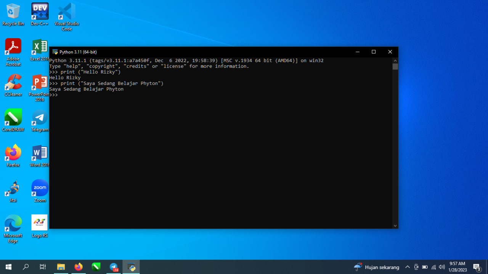
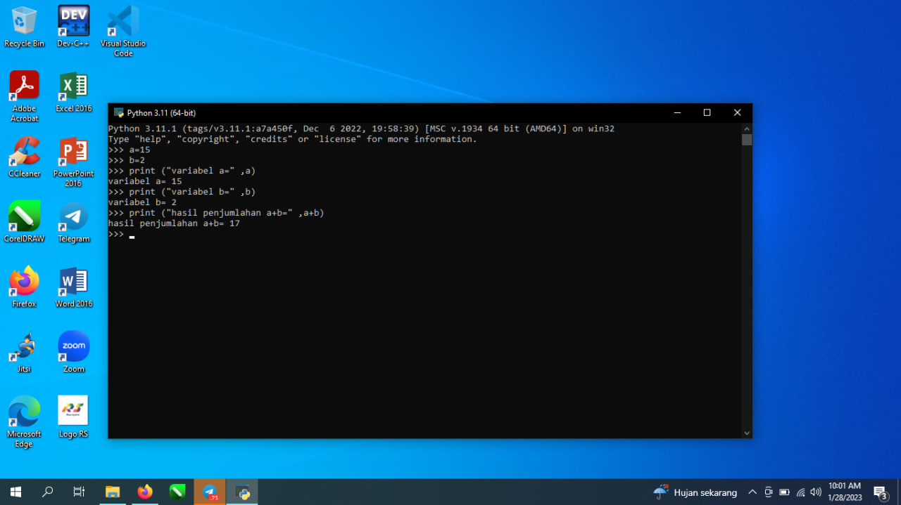

# lab2py
## Cara Mengoperasikan Phyton
1.Mengetik Hello Di Phyton dengan mengetikkan misal, print("Hello Rizky")

2.Cara menjumlahkan variabel di phyton ,dengan mengetikkan :
a = 15
b = 2
print ("Variabel a=" ,a)
variabel a= 15
print ("Variabel b=" ,b)
variabel b= 2
print ("hasil penjumlahan a=b=" ,a+b)
